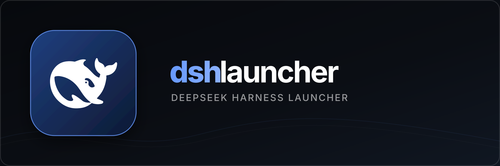
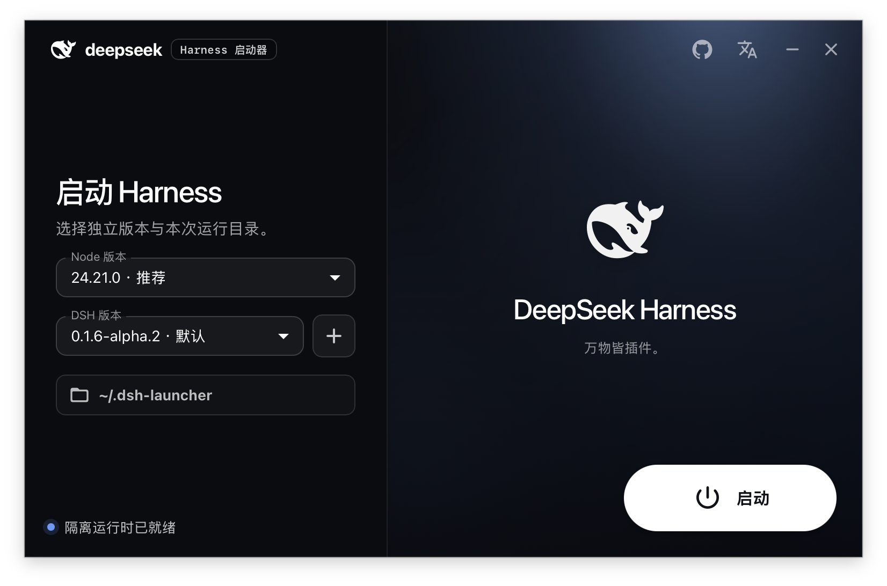

<p align="center">
  
</p>

<p align="center">
  <a href="https://github.com/tiwe0/dsh-launcher/actions/workflows/build.yml"></a>
  <a href="https://github.com/tiwe0/dsh-launcher/releases"></a>
  
  
</p>

<p align="center">
  <a href="README.md">中文</a> · <strong>English</strong>
</p>

`dsh launcher` is a lightweight desktop launcher for DeepSeek Harness. It manages Node.js, npm, and DSH within an isolated runtime, supports side-by-side installation of multiple DSH versions, and provides a unified interface for version selection, workspace configuration, and process control.

## Interface preview

<p align="center">
  
</p>

## Why dsh launcher

DeepSeek Harness is under active development, and new releases may introduce incompatible changes. Updating a global installation can disrupt established workflows and mix Node.js, npm, and DSH state into the host environment.

`dsh launcher` stores the relevant components and version data within an application-specific directory. This allows new releases to be evaluated without replacing a verified version or modifying the system Node.js environment.

## Product capabilities

- **Lightweight native desktop application**: uses Tauri and the system WebView without bundling an additional browser engine or any plugins and features unrelated to launching DSH.
- **Private runtime**: manages Node.js, npm, and DSH without requiring system-level installations; Node.js 24 is recommended by default, while Node.js 26 is downloaded only when required.
- **DSH version management**: supports online release discovery and installation, side-by-side versions, switching, removal, and default-version selection without overwriting an existing usable version.
- **Complete runtime control**: launches DSH Web within a selected workspace and stops or safely restarts the process created by the application; the default `~/.dsh-launcher` workspace is created automatically if it does not exist.
- **Consistent command environment**: places private DSH and Node.js executables at the beginning of child-process `PATH` and uses npmmirror by default for Node.js downloads and npm packages, preventing plugins from being installed into a different runtime profile.

## Quick start

### Download an application bundle

1. Visit the [Releases](https://github.com/tiwe0/dsh-launcher/releases) page.
2. Download the archive corresponding to the current operating system and CPU architecture.
3. Extract the archive and launch `dsh launcher`.
4. Retain the recommended Node.js 24 selection, choose a DSH version and workspace, and then select **Launch**.

Current release artifacts have not undergone Apple notarization, Windows code signing, or Linux repository signing. The operating system may therefore display an unsigned application warning.

### Local development

Local development requires Node.js 24, Rust stable, and the [Tauri 2 platform prerequisites](https://v2.tauri.app/start/prerequisites/).

```bash
npm ci
npm run build
npm run tauri dev
```

Run the following commands to complete the local validation suite:

```bash
npm run prepare:sidecar
npm run build
cargo test --manifest-path src-tauri/Cargo.toml
cargo test --manifest-path src-tauri/sidecar/Cargo.toml
```

## Isolation model

```text
React + MUI
    -> Tauri commands
    -> dsh-runtime native sidecar
    -> private Node runtime
       - Node 24.21.0: recommended and installed first
       - Node 26.9.0: downloaded on demand
    -> versioned DSH installations
    -> selected workspace
```

- macOS and Linux use NVM resources distributed with the application to manage the private Node.js runtime.
- Windows uses an application-specific portable Node.js runtime without requiring WSL, Git Bash, or a system Node.js installation.
- DSH uses a dedicated `DSH_HOME`, with each version installed in a separate directory.
- By default, DSH inherits the current user's `HOME` so that existing Git, SSH, and shell configuration remains available. Set `DSH_LAUNCHER_ISOLATE_HOME=1` to isolate `HOME` as well.
- The application displays the private `DSH_HOME` and command-line shim, allowing the same runtime profile to be accessed from a terminal.
- Runtime state and version metadata are stored in the user's application data directory.

This isolation applies only to the **runtime environment and version data**; it does not constitute an operating-system security sandbox. DSH child processes continue to run with the permissions of the current user.

## Current limitations

- Future DSH releases may still introduce incompatible changes. Side-by-side installation reduces upgrade risk but cannot guarantee compatibility with third-party components.
- CI artifacts are currently unsigned and are recommended only for development, testing, and internal validation.
- The launcher currently supports Node.js 24 and 26, and downloads only Node.js 24 by default.
- npmmirror is currently the default mirror source and does not yet have a graphical configuration interface.

## Technology

- Tauri 2 + Rust
- React 19 + TypeScript + Vite
- Material UI + motion transitions
- i18next + react-i18next
- A native Rust sidecar for Node.js and DSH installation, version management, and process control

> `dsh launcher` is a community project and is not an official DeepSeek distribution. DeepSeek, DeepSeek Harness, and their related marks belong to their respective owners.

## Star History

<a href="https://www.star-history.com/?repos=tiwe0%2Fdsh-launcher&type=date&legend=top-left">
  <picture>
    <source media="(prefers-color-scheme: dark)" srcset="https://api.star-history.com/chart?repos=tiwe0/dsh-launcher&type=date&theme=dark&legend=top-left" />
    <source media="(prefers-color-scheme: light)" srcset="https://api.star-history.com/chart?repos=tiwe0/dsh-launcher&type=date&legend=top-left" />
    
  </picture>
</a>
